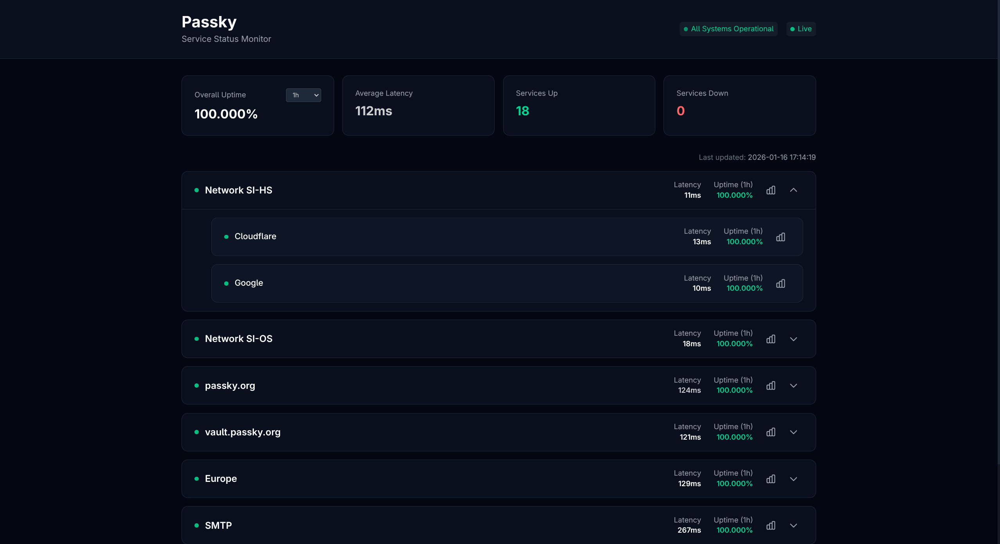
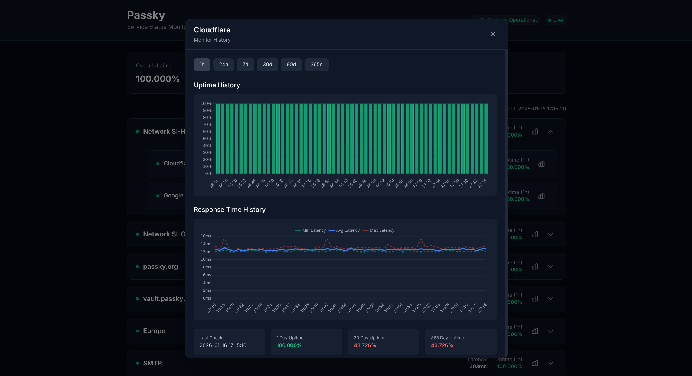

# 📊 UptimeMonitor-StatusPage

A modern, real-time status page frontend for [UptimeMonitor-Server](https://github.com/Rabbit-Company/UptimeMonitor-Server). Built with TypeScript and Tailwind CSS, featuring WebSocket-powered live updates, interactive charts, and a responsive dark theme design.

## ✨ Features

- 🔄 **Real-Time Updates** - WebSocket connection for instant status changes without page refresh
- 📈 **Interactive Charts** - Zoom and pan through uptime and latency history with Chart.js
- 📱 **Responsive Design** - Optimized for desktop, tablet, and mobile devices
- 🎨 **Multiple Themes** - 15 beautiful themes to choose from (Midnight, OLED, Ocean, Forest, Sunset, Lavender, Monochrome, Neon Mono, Cyberpunk, Nord, Dracula, Tokyo Night, Fuchsia, Rose, Sakura)
- 📊 **Custom Metrics** - Display up to 3 custom metrics per monitor (e.g., player count, TPS, memory)
- 🔔 **Live Notifications** - Toast notifications for status changes
- 📁 **Group Support** - Hierarchical organization with expandable service groups
- ⏱️ **Multiple Time Periods** - View uptime history for 1h, 24h, 7d, 30d, 90d, or 365d

## 🖼️ Preview

The status page displays:

- Overall system status and connection indicator
- Summary cards (uptime, latency, services up/down)
- Service list with real-time status indicators
- Detailed history modal with interactive charts





## 🎨 Available Themes

| Theme           | Description                                       |
| --------------- | ------------------------------------------------- |
| **Midnight**    | Dark theme with emerald accents (default)         |
| **OLED**        | Pure black theme optimized for OLED displays      |
| **Monochrome**  | Pure grayscale                                    |
| **Neon Mono**   | High-contrast monochrome with neon highlights     |
| **Cyberpunk**   | Neon pink/cyan on dark                            |
| **Ocean**       | Deep blue with cyan accents                       |
| **Forest**      | Dark green with lime accents                      |
| **Sunset**      | Warm orange/red tones                             |
| **Lavender**    | Purple/violet tones                               |
| **Fuchsia**     | Vibrant magenta-focused color palette             |
| **Rose**        | Soft rose and pink hues                           |
| **Sakura**      | Light pink cherry-blossom inspired theme          |
| **Tokyo Night** | Popular VS Code theme with deep blue/purple tones |
| **Dracula**     | Dark purple theme with vibrant neon accents       |
| **Nord**        | Arctic north-bluish color palette                 |

Users can switch themes at any time using the theme selector in the header. The selected theme is persisted in localStorage.

## ⚙️ Configuration

**Important:** Before deploying, you must configure the `config.js` file in your `dist/` or deployment directory.

### config.js

```javascript
globalThis.BACKEND_URL = "https://your-uptime-monitor-server.com";
globalThis.STATUS_PAGE_SLUG = "public";
// Amount of shown decimal places for uptimes
globalThis.UPTIME_PRECISION = parseInt("3") || 3;
// Amount of shown decimal places for latency
globalThis.LATENCY_PRECISION = parseInt("2") || 0;
// Available options: 1h, 24h, 7d, 30d, 90d, 365d
globalThis.DEFAULT_PERIOD = "24h";
// Available themes: midnight, oled, ocean, forest, sunset, lavender, monochrome, neonmono, cyberpunk, nord, dracula, tokyonight, fuchsia, rose, sakura
globalThis.DEFAULT_THEME = "midnight";
```

| Option              | Description                                               | Default    |
| ------------------- | --------------------------------------------------------- | ---------- |
| `BACKEND_URL`       | URL of your UptimeMonitor-Server instance                 | Required   |
| `STATUS_PAGE_SLUG`  | The slug of the status page defined in your server config | Required   |
| `UPTIME_PRECISION`  | Number of decimal places for uptime percentages           | `3`        |
| `LATENCY_PRECISION` | Number of decimal places for latency                      | `0`        |
| `DEFAULT_PERIOD`    | Default time period for uptime display                    | `24h`      |
| `DEFAULT_THEME`     | Default color theme                                       | `midnight` |

### Example Configuration

```javascript
// Production example
globalThis.BACKEND_URL = "https://uptime-api.example.com";
globalThis.STATUS_PAGE_SLUG = "status";
globalThis.UPTIME_PRECISION = parseInt("2") || 3;
globalThis.LATENCY_PRECISION = parseInt("2") || 0;
globalThis.DEFAULT_PERIOD = "24h";
globalThis.DEFAULT_THEME = "tokyonight";
```

## 📡 WebSocket Connection

The status page automatically connects to your UptimeMonitor-Server via WebSocket for real-time updates. Connection features include:

- **Auto-reconnect** with exponential backoff (up to 10 attempts)
- **Connection status indicator** in the header
- **Live pulse updates** without page refresh
- **Instant notifications** for monitor down/recovered events

## 🎨 Customization

### Adding Custom Themes

You can create custom themes by modifying `src/themes.ts`. Each theme requires defining colors for:

- Background colors (primary, secondary, tertiary, hover)
- Border colors
- Text colors (primary, secondary, muted)
- Status colors (up, down, degraded)
- Accent colors
- Chart colors
- Scrollbar colors
- Notification colors

### Chart Colors

Chart colors are automatically derived from the current theme. Each theme defines specific colors for:

```typescript
chartUptime: "rgba(16, 185, 129, 0.8)",      // Green for good uptime
chartUptimeWarning: "rgba(251, 191, 36, 0.8)", // Yellow for degraded
chartUptimeCritical: "rgba(239, 68, 68, 0.8)", // Red for down
chartLatency: "rgba(59, 130, 246, 1)",        // Main latency color
chartLatencyMin: "rgba(16, 185, 129, 0.5)",   // Min latency line
chartLatencyMax: "rgba(239, 68, 68, 0.5)",    // Max latency line
```

## 🔒 Security Headers

The `_headers` file includes recommended security headers for deployment:

```
X-Frame-Options: DENY
X-Content-Type-Options: nosniff
Referrer-Policy: no-referrer
Content-Security-Policy: default-src 'self'; ...
```

## 🚢 Deployment

### Static Hosting (Cloudflare Pages, Netlify, Vercel)

1. Build the project: `bun run build`
2. Deploy the `dist/` directory
3. Ensure `config.js` is properly configured
4. Copy `_headers` to the deployment directory for security headers

### Nginx Example

```nginx
events {
	worker_connections 1024;
}

http {
	include /etc/nginx/mime.types;
	default_type application/octet-stream;

	sendfile on;
	keepalive_timeout 65;

	gzip on;
	gzip_types text/plain text/css text/javascript application/javascript application/json;

	server {
		listen 80;
		server_name localhost;

		root /usr/share/nginx/html;
		index index.html;

		# Security headers
		add_header X-Frame-Options "DENY" always;
		add_header X-Content-Type-Options "nosniff" always;
		add_header Referrer-Policy "no-referrer" always;
		add_header Permissions-Policy "document-domain=()" always;
		add_header Content-Security-Policy "default-src 'self'; script-src 'self'; style-src 'self' 'unsafe-inline'; img-src 'self' data:; font-src 'self'; connect-src 'self' http: https: ws: wss:; frame-ancestors 'none'; base-uri 'self'; form-action 'self';" always;

		location / {
			try_files $uri $uri/ =404;

			# Cache static assets
			location ~* \.(js|css|png|jpg|jpeg|gif|ico)$ {
				expires 1h;
				add_header Cache-Control "public, immutable";
			}
		}

		# Health check endpoint
		location /health {
			access_log off;
			return 200 "OK\n";
			add_header Content-Type text/plain;
		}
	}
}
```

### Docker Compose

```yml
services:
  status-page:
    image: rabbitcompany/status-page:latest
    container_name: status-page
    restart: unless-stopped
    ports:
      - "8080:80"
    environment:
      # Change to your own backend server and slug
      - BACKEND_URL=https://pulse.rabbit-company.com
      - STATUS_PAGE_SLUG=passky
      - UPTIME_PRECISION=3
      - LATENCY_PRECISION=0
      - DEFAULT_PERIOD=24h
      # Available themes: midnight, oled, ocean, forest, sunset, lavender, monochrome, neonmono, cyberpunk, nord, dracula, tokyonight, fuchsia, rose, sakura
      - DEFAULT_THEME=midnight
    healthcheck:
      test: ["CMD", "curl", "-f", "http://localhost/health"]
      interval: 30s
      timeout: 10s
      retries: 3
```

## 📝 API Endpoints Used

The status page communicates with these UptimeMonitor-Server endpoints:

| Endpoint                          | Method    | Description               |
| --------------------------------- | --------- | ------------------------- |
| `/v1/status/:slug`                | GET       | Fetch initial status data |
| `/v1/monitors/:id/history`        | GET       | Raw pulse history         |
| `/v1/monitors/:id/history/hourly` | GET       | Hourly aggregated history |
| `/v1/monitors/:id/history/daily`  | GET       | Daily aggregated history  |
| `/v1/groups/:id/history`          | GET       | Group raw history         |
| `/v1/groups/:id/history/hourly`   | GET       | Group hourly history      |
| `/v1/groups/:id/history/daily`    | GET       | Group daily history       |
| `/ws`                             | WebSocket | Real-time updates         |

## 🤝 Contributing

Contributions are welcome! Please feel free to submit a Pull Request.

## 📄 License

This project is licensed under the MIT License - see the [LICENSE](LICENSE) file for details.

## 🔗 Related Projects

- [UptimeMonitor-Server](https://github.com/Rabbit-Company/UptimeMonitor-Server) - The backend server
- [PulseMonitor](https://github.com/Rabbit-Company/PulseMonitor) - Automated pulse sending client
